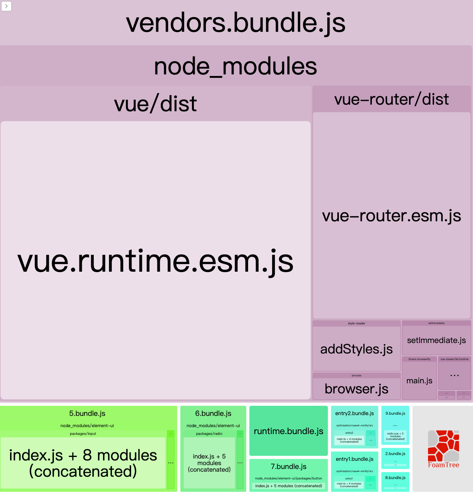

# Webpack优化实践

优化着手于两个方面:

1. 缩短构建时间
2. 减小首次加载的包大小

项目结构如下:

```txt
./src
├── comps
│   ├── button.vue
│   ├── input.vue
│   └── radio.vue
├── entry1
│   ├── App.vue
│   ├── index.html
│   └── main.ts     //使用了 comps/button.vue、comps/input.vue
├── entry2
    ├── App.vue
    ├── index.html
    └── main.ts    //使用了 comps/button.vue、comps/radio.vue

node_modules
    element-ui/packages/button/index.js
    element-ui/packages/input/index.js
    element-ui/packages/radio/index.js
```

依赖的包如下:

entry1:

```json
    "element-ui": "^2.5.4",
    "vue": "^2.6.10",
    "vue-router": "^3.0.6"
```

entry2:

```json
    "element-ui": "^2.5.4",
    "vue": "^2.6.10",
    "vue-router": "^3.0.6"
    "lodash": "^4.17.11",
```

## 0. 优化思路

关于包体积问题

1. 将共享包抽离为一个单独的chunk
2. 并尝试将部分包改为异步按需加载
3. 借助tree-shaking去除不会执行的代码

关于构建时间问题,可以将一些不会变化的包直接引入编译好的结果而不是每次都对源码作构建.

## d 

初次构建结果如下:

```txt
Version: webpack 4.30.0
Time: 18921ms
Built at: 2019-05-09 20:03:54
             Asset       Size  Chunks             Chunk Names
  entry1.bundle.js   6.19 MiB  entry1  [emitted]  entry1
  entry2.bundle.js   6.19 MiB  entry2  [emitted]  entry2
Entrypoint entry1 = entry1.css entry1.bundle.js
Entrypoint entry2 = entry2.css entry2.bundle.js
```

## 1 代码分块

使用`bundle-analyzer-plugin`分析后,得知 `entry1.bundle.js`、`entry1.bundle.js`包含大量重复的包.基于之前对`code-spliting`的认知(👉),可以定位问题是没有开启「webpack同步模块优化」

```js
    //webpack.config.js
    runtimeChunk: {
            name: entrypoint => `runtime`  //将webpack引导代码 独立打包,可以为每个chunk缩小6kb
    },
    splitChunks: {
            chunks: 'all',
            maxAsyncRequests: Infinity,
            maxInitialRequests: Infinity,
            automaticNameDelimiter: '~',
            name: false,
            cacheGroups: {
                vendors: {
                    chunks: 'initial',
                    test: /[\\/]node_modules[\\/]/,
                    priority: -10,
                    name: "vendors",
                },
                default: {
                    chunks: 'initial',
                    minChunks: 2,
                    priority: -20,
                    reuseExistingChunk: true,
                    name: "default",
                }
            }
        }
    }
```

开启后再次构建结果如下:

```txt
 Time: 14453ms
Built at: 2019-05-11 11:06:43
             Asset       Size   Chunks             Chunk Names
  entry1.bundle.js     26 KiB   entry1  [emitted]  entry1
  entry2.bundle.js   26.7 KiB   entry2  [emitted]  entry2
 runtime.bundle.js   6.04 KiB  runtime  [emitted]  runtime
 vendors.bundle.js   1.49 MiB  vendors  [emitted]  vendors
       vendors.css    194 KiB  vendors  [emitted]  vendors
```

> 可以看到共享第三方依赖被单独打包到了`vendors.bundle.js`, `runtime.bundle.js`是webpack引导代码

## 2 按需引入

基于webpack的 「import()」 和vue的「动态组件」支持,作出如下改动

```js
/* 1. 使用 「全局动态组件」代替 「全量注册」 */
// Vue.use(ElementUI) //❌
Vue.component('el-button', () => import(/* webpackPrefetch:true */'element-ui/packages/button/index.js')) //✅

/* 2. 改变路由加载组件的方式为异步 */
// { path: "/button", component: require("@/comps/button.vue").default } //❌
{ path: "/button", component: () => import("@/comps/button.vue") } //✅
```

改造后再次打包,结果如下:

```txt
Time: 10431ms
Built at: 2019-05-11 11:15:17
             Asset       Size   Chunks             Chunk Names
       0.bundle.js   7.78 KiB        0  [emitted]
       1.bundle.js   27.8 KiB        1  [emitted]  
       2.bundle.js   14.1 KiB        2  [emitted]  
       3.bundle.js   9.93 KiB        3  [emitted]  
       4.bundle.js   7.72 KiB        4  [emitted]  
       5.bundle.js    8.4 KiB        5  [emitted]  
  entry1.bundle.js   11.6 KiB   entry1  [emitted]  entry1
  entry2.bundle.js     12 KiB   entry2  [emitted]  entry2
 runtime.bundle.js   8.71 KiB  runtime  [emitted]  runtime
 vendors.bundle.js    775 KiB  vendors  [emitted]  vendors
       vendors.css    194 KiB  vendors  [emitted]  vendors
```

> 打包出了6个异步模块,其中3个是eleme的组件(来自「element-ui/packages/」),3个是当前项目中的异步组件.

## 3. 移除Dead Code

也就是`tree-shaking`


让ts-loader、babel-loader使用es模块标准编译

```json
//tsconfig.json
"module": "es2015",
//.babelrc
"modules":false,
```

开启tree-saking功能.

```js
//webpack.config.js
optimization: {
    sideEffects: true, //production环境默认开启
}
```

标出有副作用的文件 避免被shaking

```js
// package.json
 "sideEffects": ["src/comps/elemeRegister.ts","*.css"]
```

```txt
Time: 13564ms
Built at: 2019-05-11 13:54:03
             Asset       Size   Chunks             Chunk Names
       0.bundle.js   6.19 KiB        0  [emitted]  
       1.bundle.js   27.8 KiB        1  [emitted]  
       2.bundle.js   14.1 KiB        2  [emitted]  
       3.bundle.js   9.93 KiB        3  [emitted]  
       4.bundle.js   6.14 KiB        4  [emitted]  
       5.bundle.js   6.82 KiB        5  [emitted]  
  entry1.bundle.js   10.5 KiB   entry1  [emitted]  entry1
  entry2.bundle.js   10.7 KiB   entry2  [emitted]  entry2
 runtime.bundle.js   8.71 KiB  runtime  [emitted]  runtime
 vendors.bundle.js    309 KiB  vendors  [emitted]  vendors
       vendors.css    194 KiB  vendors  [emitted]  vendors
```

> 可以看到每个chunk相对shaking之前都变小了

## 压缩

webpack4使用[TerserPlugin](https://webpack.js.org/plugins/terser-webpack-plugin/) 来压缩变量名、消除日志、注释、语法精简,包括tree-shaking也是tester的职责.

```js
//webpack.config.js
 optimization: {
        minimize: true,
        minimizer: [
            new TerserPlugin({
                terserOptions: {
                    compress: {
                        /* 是否删除日志 */
                        drop_console: false,
                    },
                    output: {
                        /* (default false) true or "all" to preserve all comments,"some" to preserve some comments, a regular expression string (e.g. /^!/) or a function.  */
                        comments: false,
                    },
                },
            }),
        ],
 }
```

```txt
Time: 15861ms
Built at: 2019-05-11 14:24:07
             Asset       Size   Chunks             Chunk Names
       0.bundle.js   1.68 KiB        0  [emitted]  
       1.bundle.js   10.9 KiB        1  [emitted]  
       2.bundle.js   4.87 KiB        2  [emitted]  
       3.bundle.js    3.2 KiB        3  [emitted]  
       4.bundle.js   1.65 KiB        4  [emitted]  
       5.bundle.js   1.93 KiB        5  [emitted]  
  entry1.bundle.js   3.16 KiB   entry1  [emitted]  entry1
  entry2.bundle.js   3.26 KiB   entry2  [emitted]  entry2
 runtime.bundle.js   2.13 KiB  runtime  [emitted]  runtime
 vendors.bundle.js    111 KiB  vendors  [emitted]  vendors
       vendors.css    194 KiB  vendors  [emitted]  vendors
```

> 可以看到每个chunk相对minify之前都变小了

## production模式

前面的步骤都是在`development`模式打包,事实上 如果用`production`模式webpack会启用更多的优化措施(👉[Webpack Mode][webpack_mode],[Webpack Optimization][webpack_optimization]).

改为生产模式

```js
//webpack.confi.js
    mode:'production'
```

[webpack_mode]: https://webpack.js.org/configuration/mode/#usage
[webpack_optimization]: https://webpack.js.org/configuration/optimization#optimizationminimize

打包结果:

```txt
Time: 15664ms
Built at: 2019-05-11 14:42:06
             Asset       Size  Chunks             Chunk Names
             1.css    194 KiB       1  [emitted]  vendors
       2.bundle.js  377 bytes       2  [emitted]  
       5.bundle.js      8 KiB       5  [emitted]  
       6.bundle.js   3.02 KiB       6  [emitted]  
       7.bundle.js   1.44 KiB       7  [emitted]  
       8.bundle.js  356 bytes       8  [emitted]  
       9.bundle.js  645 bytes       9  [emitted]  
  entry1.bundle.js   1.06 KiB       3  [emitted]  entry1
  entry2.bundle.js   1.12 KiB       4  [emitted]  entry2
 runtime.bundle.js   2.13 KiB       0  [emitted]  runtime
 vendors.bundle.js   95.8 KiB       1  [emitted]  vendors
```

现在chunk里最大的是`1.css`,是已经压缩过的element-ui的样式,194 KiB.(可能这就是element-ui不适合移动端的原因?)

其次是`vendors.bundle.js`里面95.8 KiB主要由vue构成,可以理解.

- vue-runtime 63.22KB
- vue-router 24.08 kb



## 缩短构建时间

这一步适合开发环境,旨在缩短编译时间(早点下班).

初始构建耗时: `Time: 15664ms`

### 预先构建(CDN)

对于一些不会变的第三方库,可以通过使用全局引入实现构建好的bundle,从而减少webpack的构建的文件负担.

> 再次强调,这只适用与开发环境,因为这样就失去了tree-shaking的功能了.

告知webpack已经存在的全局模块,构建时会跳过这些模块.

```js
//webpack.config.js
externals: {
    /* 
      key: 决定导入名称,e.g import "xx"
      value: 全局变量的名称, 例如
  */
    'vue': 'Vue2',
    'vue-router': 'VueRouter2',
    'lodash-es': '_',
}
```

模版中全局引入模块

```html
<% if (process.env.NODE_ENV=="development") { %>
    <!-- 开发环境 -->
    <script src="https://cdn.jsdelivr.net/npm/vue@2.6.10/dist/vue.runtime.min.js"></script>
    <script src="https://unpkg.com/vue-router/dist/vue-router.min.js"></script>
    <script src="https://cdn.bootcss.com/lodash.js/4.17.12-pre/lodash.js"></script>
<% } else { %>
    <!-- 生产环境 -->
<% } %>
```

构建耗时:`Time: 9741ms`


### 预先构建(DLL)

这种方式思路上面和CDN的方式一样.

新建一个webpack配置,用于打包第三方库

```js
    //webpack.dll.config.js
    entry: {
        vendors_dll: ['vue','lodash','axios','vue-router']
    },
    output: {
        path: _resolve(__dirname, 'dll'),
        filename: 'dll_[name].js',
        /* 「entry的导出」的变量名 */
        library:"dll_[name]",
        /*「entry的导出」挂在哪个全局变量上
            var     dll_lib = entry            直接使用作为全局变量(变量名取决于library配置)
            this    this["myComps"] = entry    这将挂在window上 */
        libraryTarget:'var'
    },
    plugins:[
         /*  It creates a manifest.json file, which is used by the DllReferencePlugin to map dependencies. */
        new webpack.DllPlugin({
            /* 模块映射清单文件生成路径 */
            path: _resolve(__dirname,'./dll/[name].manifest.json'),
            /* entry的全局变量名称,应与 output.library一致 */
            name: '[name]',
        })
    ]
```

生成文件如下:

```txt
optimization/case6-dll/dll
├── vendors_dll.js
└── vendors_dll.manifest.json
```

使用引用「模块映射清单文件」

```js
//webpack.config.js
plugins:[
    new webpack.DllReferencePlugin({
        manifest: require("./dll/vendors_dll.manifest.json"),
    }),
]
```

> 相关文档👉 [webpack-config.output.library](https://webpack.js.org/configuration/output#outputlibrary),[DllPlugin](https://www.webpackjs.com/plugins/dll-plugin/),[DllReferencePlugin](https://webpack.js.org/plugins/dll-plugin/)

模版中全局引入模块

```html
<script src="<%=vendors_dll_path%>"></script>

<% if (process.env.NODE_ENV=="development") { %>
    <!-- 开发环境 -->
    <script src="./dll/vendors_path.js"></script>
<% } else { %>
    <!-- 生产环境 -->
<% } %>
```

此时的构建耗时:`Time: 9706ms`

### 更快的Loader

使用`@babel/preset-typescript`代替`ts-loader`.

`npm i -D @babel/preset-typescript`

```js

//.babelrc
"presets": [
    "@babel/preset-typescript",
    ...其他预设省略
  ]
//webpack.config.js
{
    test: /(\.js)|(\.ts)$/,
    loader: 'babel-loader',
    options: {
        cacheDirectory: true
    },
},
```

此时构建耗时:`Time: 1361ms`

> 可以看到,已经降到秒级的构建速度了
